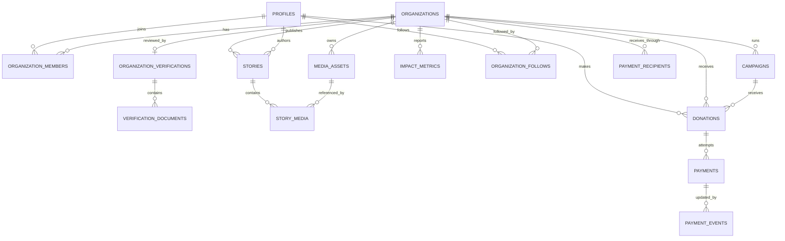

# Database Architecture

## Principles

- PostgreSQL is the relational source of truth. Supabase currently hosts it.
- Supabase Auth authenticates users; `public.profiles` is the product identity.
- Supabase Storage stores objects; PostgreSQL stores provider-neutral metadata.
- Money is stored as integer cents. Financial provider payloads are evidence, not domain state.
- Tables exposed through the Data API use explicit grants and RLS.
- Versioned migrations are the source of truth. `supabase/schema.sql` is a legacy snapshot.
- Schema changes follow add, backfill, validate, migrate code, deprecate, then eventually drop.

## Audit Before This Migration

The initial model had `profiles`, `donor_profiles`, and a one-user `ngo_profiles` table. Public NGO discovery ran through the `list_public_ngos()` security-definer RPC, which exposed the account email and mixed public identity, verification state, goals, media URLs, and institutional data. Stories, campaigns, and impact metrics existed only as frontend types or demo arrays.

Payments had already been split into `donations`, `payments`, `payment_recipients`, `payment_events`, and reconciliations. Legacy Stripe columns remained for compatibility. Media uploads called Supabase Storage directly and profile records kept absolute URLs as their only locator.

The first migration also depended on `profiles` and `touch_updated_at`, but those objects existed only in `supabase/schema.sql`. `20260701000000_core_schema_baseline.sql` now records that foundation so an empty environment can be reconstructed from migrations.

## Domain Model



## Data Dictionary

| Table | Responsibility |
| --- | --- |
| `profiles` | TranquiliCare identity linked to the current Auth user. |
| `donor_profiles` | Donor-only presentation preferences. |
| `organizations` | Canonical public and institutional organization identity. |
| `organization_members` | Many-to-many access relationship with simple roles. |
| `organization_verifications` | Review lifecycle. Internal notes never enter public projections. |
| `verification_documents` | Private document metadata using provider, bucket, and storage key. |
| `media_assets` | Provider-neutral metadata for images, videos, and documents. |
| `stories` | Narrative content with draft, published, and archived states. |
| `story_media` | Ordered relationship between stories and media assets. |
| `impact_metrics` | Structured, sourced results. Goals are not copied here as outcomes. |
| `organization_follows` | A donor's continuing relationship with an organization. |
| `campaigns` | Time-bound fundraising goals. Raised totals remain derived from donations. |
| `donations` | Donation intent and beneficiary. Legacy text keys remain temporarily. |
| `payments` | Provider-neutral payment attempts and financial amounts. |
| `payment_recipients` | Provider identities used to receive funds. |
| `payment_events` | Idempotent external event ledger keyed by provider and event ID. |
| `audit_logs` | Server-only log for sensitive administrative actions. |

## Compatibility Phase

`ngo_profiles` remains as a deprecated compatibility write model. A trigger mirrors current profile writes into `organizations`, creates the owner membership, and preserves verification status. This prevents a simultaneous rewrite of signup and profile editing. Public marketplace reads now use the `OrganizationRepository` and the `public_organizations` safe view.

The following legacy financial fields remain intentionally:

- `donations.donor_id`, with `donor_profile_id` added as the domain FK.
- `donations.ngo_id`, with `organization_id` added when the destination is a persisted organization.
- `donations.campaign_id`, with `campaign_uuid` added for persisted campaigns.
- `payment_recipients.organization_id` (text), with `organization_uuid` added.
- Provider-specific Stripe columns documented in `payments-architecture.md`.

Demo destination IDs are strings and are not fabricated into production organizations. They therefore remain only in compatibility columns.

## Access Model

- Visitors read only active organizations, published stories, public media, published impact metrics, and active/completed campaigns.
- A profile reads its own private profile, donations, follows, and memberships.
- Active organization members can read their organization workspace.
- `owner`, `admin`, and `editor` can edit public organization content. Membership administration is limited to owner/admin.
- Verification review fields and payment state are backend-controlled.
- `audit_logs`, payment events, reconciliation data, and recipient internals have no client grants.
- `verification-private` is a private bucket. Owner/admin access is checked by organization membership; administrative review uses backend credentials.

The `private` schema contains narrowly scoped RLS helpers. They use the authenticated profile ID, expose no rows, have fixed search paths, and are not part of the Data API.

## Media Storage

Domain code depends on `MediaStorage`. `SupabaseMediaStorage` is the current adapter. A stored object is represented by:

```text
provider + bucket + storage_key
```

`external_url` is retained only for legacy assets and external media. New story media can move from Supabase Storage to R2/S3 by copying objects, updating `media_assets.provider/bucket/storage_key`, and replacing the adapter. Stories and organizations keep their internal media IDs.

Buckets:

- `profile-media`: existing public profile/cover images, 8 MiB, image MIME types.
- `stories-public`: public story media, 12 MiB, selected image/video MIME types.
- `verification-private`: private verification documents, 10 MiB, PDF/image MIME types.

Large production video should later use a dedicated video provider. `provider_asset_id`, `playback_id`, and duration fields are already available without pretending that a video is just a large image.

## Rebuilding And Migrating

### New environment

1. Create a Supabase project or compatible PostgreSQL plus the required Auth/Storage schemas.
2. Run `supabase db push` from the repository.
3. Deploy Edge Functions and configure server-only secrets.
4. Copy storage objects separately.

### Standard PostgreSQL export

Use a direct database connection and keep credentials outside shell history:

```bash
pg_dump --format=custom --no-owner --no-acl --file=tranquilicare.dump "$DATABASE_URL"
pg_restore --clean --if-exists --no-owner --no-acl --dbname="$TARGET_DATABASE_URL" tranquilicare.dump
```

For a schema-only review, add `--schema-only`. For a data-only export, add `--data-only`. Test restoration in a disposable database before treating a dump as a backup.

### Auth caveat

`profiles.id` currently equals `auth.users.id`. A PostgreSQL dump preserves the relational IDs, but moving authentication requires a separate provider migration plan for password hashes, OAuth identities, MFA, and active sessions. Do not recreate users with new IDs: preserve profile IDs and map the new auth identity to them.

### Storage caveat

A database dump includes `storage.objects` metadata, not the file bytes. Export objects bucket by bucket, verify counts and checksums, import them to the new provider, then update `media_assets`. Private objects must remain private during transfer.

## Portability Audit

| Area | Current dependency | Migration impact |
| --- | --- | --- |
| PostgreSQL | Standard tables, constraints, triggers, RLS plus Supabase `auth.uid()` helpers | Low to medium. Schema/data move with pg_dump; authorization helpers need replacement if Auth changes. |
| Auth | Supabase Auth and PKCE client | Medium to high. Identity mapping and sessions need a dedicated project. Domain FKs remain stable. |
| Storage | Supabase buckets and object policies | Medium. Copy files and replace `SupabaseMediaStorage`; domain rows remain. |
| Edge Functions | Supabase Deno runtime | Medium. HTTP handlers/services are portable; runtime bootstrapping and secrets move. |
| Realtime | Supabase Postgres Changes for donation confirmation and aggregate impact | Medium. Replace subscriptions or keep polling; persisted data is unaffected. |

## Deferred Decisions

- A normalized cause catalog is deferred until multi-cause membership is a real product workflow; `primary_category` remains controlled by the application.
- Demo stories and campaigns remain development data and are not inserted into production.
- Reviewer/admin identity and the internal verification console need a product decision before adding administrative RLS roles.
- Full deletion/anonymization policy needs legal and operational review. Financial history remains restricted and preserved.
- Existing absolute avatar/cover URLs are backfilled into `media_assets` with normalized keys when recognizable and retained as legacy URLs for rollback.

## References

- [Supabase Row Level Security](https://supabase.com/docs/guides/database/postgres/row-level-security)
- [Supabase Storage access control](https://supabase.com/docs/guides/storage/security/access-control)
- [Supabase backup and restore](https://supabase.com/docs/guides/platform/migrating-within-supabase/backup-restore)
- [PostgreSQL pg_dump](https://www.postgresql.org/docs/current/app-pgdump.html)

